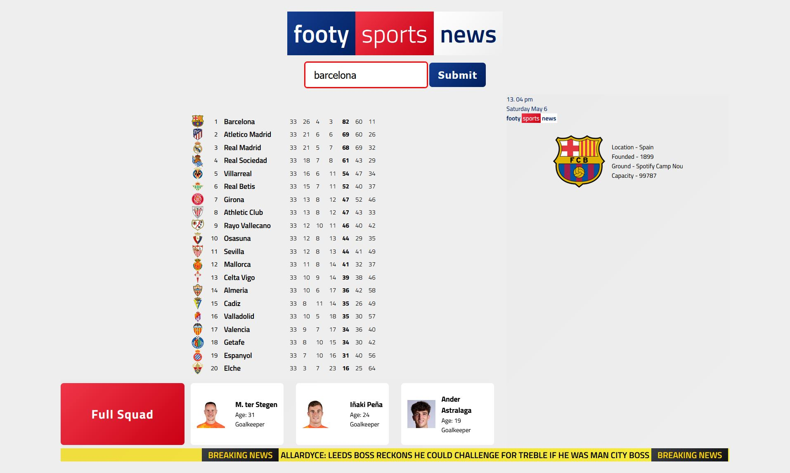

<h1 align="center">Footy Sports News | NickOD.xyz</h1>

 

## Overview

Enter any team name into the search box and get back a whole host of data and footballing information. Styled 'loosly' on sky sports news.

Using the [API-Football](https://www.api-football.com/) RESTful API and it's many endpoints.

As I can't expose my API key in the frontend of my app, I've built a node.js backend server to handle the API calls. Routing the repsonse to my own local endpoints and then grabing the data stored locally to render into the app.

 

## Live Site

[Footy Sports New](https://footy-sports-news.herokuapp.com/) - Still a work in progress

 

## Sticking Points & What I learned

- Routes & Routing

  - Having got the app to work fine with all routes locally I then deployed my app to Heroku. However I soon discovered that my 'hard' coded url's ( const url = new URL('http://localhost:5555/team') ) were not going to work in production. It took me a while to figure out what the issue actually was, as Heroku logs didn't through up any errors for me to investigate. Once I finally ruled out a few different options I finally realised it was down to this url syntax. It took a few hours and multiple Heroku pushes but I finally found the solution in using ( const url = new URL('/team', window.location.href) ). This allowed my route to bind to the URL & port Heroku was using via my process.env.PORT in my index.js

  - With this being my first node.js backend app, I really didn't know where to start. So had to think of some logical reasons and test every part of my code I thought maybe causing this issue. Whilst it was a lot of time spent, rewritting code and changing minor bits here and there it was a great experience for me to try my code in different ways. I really got to nail down some of the concepts and features of node, express etc that I wouldn't have had this not occured.

- CORS

  - CORS is a security feature in web browsers that prevents cross-origin requests. To make API calls from a web app to a different domain, I created a backend server that acts as a proxy to the API server.

- Node.js
  - Having never used Node.js before I had fun reading and watching tutorials on how to set up the backend server within node. As well as learning about a few of it's dependencies like express, cors, dotenv and axios
  - Implementing this has really helped me take some time to study and learn more about HTTP requests, how they work and how to apply them within my code.

 

## Site To-Do

- Style for mobile uses
- Create autoscroll for squad
- Scrap live data for breaking news
- DONE - Decide on data and information to be displayed in the GUI
- DONE - Style for large screen users
- Sections:
  - DONE - Header
  - DONE - Search Box
  - DONE - Main Content
  - DONE - Footer
- DONE - API calls
- DONE - Push to Heroku

 

## Built with

- Mobile first workflow
  - Flexbox
  - Grid
- Semantic HTML5 markup
- CSS custom properties
  - BEM
- JS
  - Node.js
    - Express
    - Axios
    - CORS
    - Dotenv
  - API fetch methods
- Hosted on Heroku

 

## Author

- Portfollio - [NickOD.xyz](http://www.NickOD.xyz)
- LinkedIn - [LinkedIn](https://www.linkedin.com/in/nick-odonoghue/)

 

## Useful resources

Coming SOON

 

## Acknowledgments

[Le Wagon](https://www.lewagon.com/) & all the teachers, TAs and classmates from <em>1122</em>

[Frontend Mentor](https://www.frontendmentor.io/) & everyone kind enough to leave feedback

[w3schools](https://www.w3schools.com/)

[Web Dev Simplified](https://www.youtube.com/WebDevSimplified)

[Kevin Powell](https://www.youtube.com/kepowob)

[Wes Bos](https://wesbos.com/)
